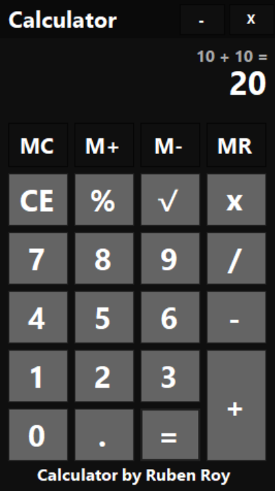

# Calculator 

A basic calculator built with C# in Visual Studio 2022 using Windows Forms on the .NET Framework.


<p align="center">
  
</p>

## Download

You can download the completed executable of the Calculator from the [releases page](https://github.com/rubendavidroy/Calculator/releases).

## Getting Started

### Prerequisites

- [Visual Studio 2022](https://visualstudio.microsoft.com/vs/)
- .NET Framework (usually comes bundled with Visual Studio).

### Installation

1. Clone the repository:
   ```bash
   git clone https://github.com/rubendavidroy/Calculator.git
    ```
2. Open the .sln file in Visual Studio 2022.

3. Press F5 to build and run the application.

# License
This project is licensed under the MIT License. See the [LICENSE](LICENSE) file for details.
